# DER del backend — Coordinacion3F2.0

Contexto y contenido del modelo de datos relacional diseñado para el backend
real (Supabase/Postgres) del portal de Coordinación. Pensado para pasarse
como contexto a otra sesión de Claude sin depender del resto de la
conversación en la que se armó.

**Estado: diseñado y escrito, NO aplicado todavía a ninguna instancia de
Supabase.** Ver la sección "Estado actual y qué falta" al final — hay una
decisión explícita de no migrar hasta cerrar los formularios de carga.

---

## 1. Qué es esto y por qué existe

El portal de Coordinación tiene dos repos:

- **`Coordinacion-3f` (v1)** — Next.js + Supabase, abandonado como frontend,
  pero con un núcleo de modelo de datos sólido: catálogos normalizados,
  roles, actualizaciones fechadas (nunca se pisa una carga vieja), serie
  histórica y auditoría por trigger.
- **`Coordinacion3F2.0` (v2)** — el repo activo hoy, Vite + React, corriendo
  como prototipo 100% `localStorage` (sin backend real). Le agregó al diseño
  de v1 varios módulos que v1 nunca tuvo: seguimientos, compromisos con
  origen polimórfico, monitoreos, mesas de trabajo, eventos con
  requerimientos, planificación anual, y posicionamiento internacional.

Este DER es la **fusión de los dos**: toma el núcleo relacional de v1 (el
que hoy no tiene ningún repo activo usándolo) y le suma los módulos de v2,
para que cuando el portal deje de vivir en `localStorage` tenga un esquema
real de Postgres detrás, sin perder ninguna de las dos partes.

Vive en `supabase/migrations/0001_esquema.sql` (**43 tablas, 14 tipos
enum**), escrito el 19/08/2026. Posicionamiento internacional se rediseñó
el 21/08/2026 y `temas_monitoreo` sumó `compromiso_id` el 25/08/2026 (ver
sección 2, puntos 9 y 10).

El 25/08/2026 se había agregado `puntuales` como tabla propia (PR #1); se
revirtió el 01/09/2026 al confirmarse que el prototipo nunca la adoptó —
ver punto 11.

El 14/09/2026, `compromisos` sumó un cuarto origen posible (`evento`) y dos
tablas nuevas (`reuniones_evento`, `reuniones_evento_eventos`), para que la
reunión de agenda de eventos pueda generar compromisos entre áreas — ver
punto 12. Eso vive en `supabase/migrations/0036_compromisos_de_evento.sql`,
**escrita y todavía sin aplicar**: el `0001` describe el esquema tal como está
corrido en la base, y no se lo edita.

---

## 2. Decisiones de diseño que no son obvias mirando el SQL

Estas son las que vale la pena que alguien que solo lea el diagrama se
pierda si no se las explican:

1. **`objetivo` es nullable en `act_cuantitativas`.** No es una corrección
   cosmética: sale de auditar las 8 planillas (`_db`) reales el 16/08/2026.
   Buena parte de las observaciones cuantitativas son indicadores/contadores
   sin meta formal, no proyectos con objetivo comprometido — Trabajo y
   Producción tenía 107/107 filas sin objetivo, Obras 36/36, Seguridad
   162/163. Sin objetivo no hay % de avance ni banda de cumplimiento, y el
   dato se carga igual (`porcentaje_avance` queda `null`, no `0`).

2. **`id_legible` es cosmético, no la clave primaria.** El formato
   `SEC-AAAA-NNN` que ve el usuario (heredado de v2) es una columna `text
   unique`, no el PK. El PK real de todo es `uuid`. Importa para cualquier
   FK que se escriba a mano: siempre apunta al `uuid`, nunca al legible.

3. **`es_estrategico` en `proyectos` absorbe tres conceptos de v1 que
   vivían separados**: la pestaña `Ejes_Estratégicos`, el campo "Interés de
   Roco", y los "puntuales estratégicos". En vez de tres mecanismos
   paralelos (que en v1 podían desincronizarse entre sí), es un solo flag
   booleano con su bloque de campos (`motivo_estrategico_id`,
   `responsable_politico`, `compromiso_publico`, `origen_estrategico`, quién
   y cuándo lo marcó).

4. **`actualizaciones` es de solo alta, nunca de update.** Cargar la
   observación de junio no pisa la de mayo — cada fila es una foto fechada.
   `act_cuantitativas` y `act_comparativas` cuelgan 1:1 de una
   `actualizacion_id` (herencia por tabla, no columnas opcionales mezcladas
   en la misma fila) porque una actualización cualitativa no tiene ninguno
   de los dos, una cuantitativa solo el primero, una comparativa solo el
   segundo.

5. **`compromisos` tiene origen polimórfico con FK dura, no un
   `tipo + id` genérico.** Cuatro columnas nullable
   (`id_seguimiento_origen`, `id_tema_origen`, `id_reunion_origen`,
   `id_reunion_evento_origen` — esta última sumada el 14/09/2026, ver
   punto 12), con un `CHECK (num_nonnulls(...) <= 1)` que garantiza que
   como máximo una esté cargada (o ninguna, si el compromiso se creó a mano
   sin origen). La alternativa típica —una columna `origen_tipo` de texto
   libre más un `origen_id` sin FK— no la elimina el motor de base de datos
   si un registro de origen se borra; esta sí.

6. **La auditoría es por trigger genérico sobre la tabla, no por bitácora
   de aplicación.** Reemplaza el `historial` de v2 (que era app-level: solo
   registraba lo que pasaba por la UI). Con un trigger en Postgres, un
   `UPDATE` hecho a mano desde el editor SQL de Supabase queda registrado
   igual que uno hecho desde la pantalla — la tabla `auditoria` guarda
   `datos_antes`/`datos_despues` en `jsonb`.

7. **Datos personales de vecinos, marcados desde el esquema.** El campo
   `pedidos_roco.solicitante` puede contener el nombre de un vecino —
   comentado en el SQL como "fuera del grant de select por defecto en
   `0003_rls.sql`. Ley 25.326". Esto conecta con una regla que ya está en el
   `CLAUDE.md` del workspace: datos de reclamos/casos sociales se agregan a
   nivel barrio en outputs públicos, nunca a nivel persona.

8. **Sin tildes ni ñ en identificadores ni literales SQL.** Convención
   heredada de v1, mantenida por consistencia (no por limitación técnica de
   Postgres).

9. **Posicionamiento internacional, rediseñado el 21/08/2026.** JP revisó el
   DER en Lucidchart y simplificó todo el módulo. Se elimina
   `acciones_internacionales` (con `tipo`, `pais_id`, `alcance`,
   `fecha_inicio`, `fecha_limite`, `fecha_resolucion`, `resultado`,
   `descripcion`, `referente`) y sus dos tablas puente
   (`acciones_internacionales_proyectos`, `acciones_internacionales_ods`),
   incluido el catálogo de **ODS** (Objetivos de Desarrollo Sostenible —
   Agenda 2030 de la ONU) que colgaba de ahí. En su lugar, dos tablas nuevas:
   `proyectos_posicionamiento` (una fila por proyecto: nombre, organismo,
   área, estado, financiamiento, objetivo) y `actualizaciones_posicionamiento`
   (una fila por observación fechada, mismo patrón append-only que
   `actualizaciones` — punto 4). Ya no hay vínculo M:N con la tabla general
   `proyectos`: un proyecto de posicionamiento es una entidad propia.

   **Aviso de procedencia, para que quede escrito:** ni el catálogo de ODS
   (que existía en el diseño anterior) ni los campos `organismo_id`,
   `area_id` y `financiamiento_usd` de la tabla nueva aparecieron en la
   pestaña real "Estado de proyectos" que se relevó de `Coordinacion_db` el
   19/08/2026 (los 8 proyectos reales — CIPPEC, UBA, CIIAR, etc. — solo
   traían Programa/Proyecto/Estado/Comentarios/Fecha). Son campos heredados
   del diseño original del prototipo v2, no verificados contra un dato real.
   Si en algún momento se confirma que sí se cargan en la gestión real de
   posicionamiento, esto queda resuelto; si no, hay que revisar si siguen
   teniendo sentido en el esquema.

10. **`temas_monitoreo.compromiso_id`, agregado el 25/08/2026.** Distinto de
    `compromisos.id_tema_origen`: `id_tema_origen` guarda de qué tema NACIÓ
    un compromiso (origen, uno solo, para siempre). `compromiso_id` es la
    inversa — dice que este tema de esta semana es una novedad sobre un
    compromiso que YA EXISTE, sin crear uno nuevo. Hace falta porque los
    compromisos no nacen semana a semana (nacen en Seguimiento, cada 6
    semanas) pero el Monitoreo semanal sí necesita poder registrar avances
    sobre los que ya están en curso. Como `temas_monitoreo` nunca se pisa
    (punto 4), los temas vinculados al mismo compromiso, ordenados por
    fecha, ya son su historial — no hace falta otra tabla. `proyecto_id` y
    `compromiso_id` son excluyentes entre sí
    (`CHECK num_nonnulls(proyecto_id, compromiso_id) <= 1`).

11. **`puntuales`, agregado el 25/08/2026 y revertido el 01/09/2026 — no es
    tabla propia.** Se había agregado `puntuales` + `actualizaciones_puntuales`
    como par de tablas separadas de `proyectos` (con `puntual_id` colgando
    de `temas_monitoreo`, `compromisos` y `alertas`, PR #1), con el
    argumento de que un puntual "surge en el momento" y no cuelga de ningún
    programa. Pero el prototipo (`src/`) nunca adoptó ese modelo — sigue
    usando `eje='Puntual'` sobre `proyectos`, tal como lo documenta el
    comentario en `catalogos.js` ("separar esa colección en el prototipo es
    un cambio más grande que JP pidió dejar para después"). Sin ninguna
    pantalla ni flujo que tratara un puntual distinto de un proyecto POA, se
    revirtió: un puntual vuelve a ser una fila de `proyectos`, con
    `eje_id = 'Puntual'` — el mismo mecanismo que ya documenta el punto 3.
    Se sacaron las dos tablas, las tres columnas `puntual_id`, el CHECK
    `compromisos_vinculo_unico` completo, y `puntual_id` salió del
    `num_nonnulls(...)` de `temas_monitoreo_vinculo_unico` (punto 10).

12. **Compromisos de evento, agregado el 14/09/2026 — cuarto origen
    polimórfico + tabla de reunión propia.** Hasta acá `eventos` y
    `requerimientos_evento` no tenían forma de generar un `compromiso`: el
    enum `origen_compromiso` solo admitía `seguimiento | monitoreo | mesa`.
    El caso real que lo motivó: en la reunión de agenda de eventos, Zoonosis
    (Salud) organiza una jornada con mascotas en una plaza y le pide a
    Ambiente que limpie el lugar los días previos, y a Seguridad que calcule
    la dotación de efectivos — dos compromisos entre áreas que nacen del
    mismo evento, y no todo evento genera alguno.

    Se sumó `reuniones_evento` (+ la puente `reuniones_evento_eventos`, M:N
    porque una reunión repasa varios eventos y un evento se trata en varias
    reuniones sucesivas) como cuarto origen posible de `compromisos`, mismo
    patrón que `seguimientos`/`temas_monitoreo`/`reuniones_mesa`: entra al
    CHECK `compromisos_origen_unico`, que pasa de tres a cuatro columnas.

    **Requerimiento vs. compromiso, la distinción que ordena el diseño:**
    un `requerimiento_evento` es un ítem catalogado con cantidad
    (`solicitado → confirmado → entregado`); un `compromiso` es una acción
    con responsable y fecha límite (`pendiente → en_curso → cumplido`, más
    `Alerta` deducida al vencer — ver el glosario). No se fusionan: se
    conectan con `compromisos.requerimiento_id`, para cuando un
    requerimiento necesita escalar a algo con fecha propia.

    Dos columnas nuevas en `compromisos`, no una — y con roles distintos:
    - `id_reunion_evento_origen` es el **origen** (dónde nació el
      compromiso) y entra al CHECK de origen único.
    - `evento_id` es el **objeto** (sobre qué evento es), igual que
      `proyecto_id` — queda fuera del CHECK a propósito. Cubre los tres
      casos reales: compromiso de evento acordado en reunión (los dos
      campos cargados), compromiso de evento cargado a mano sin reunión
      (solo `evento_id`), y acuerdo general de la reunión que no es de
      ningún evento puntual (solo `id_reunion_evento_origen`).

    `requerimiento_id` no tiene FK simple: si un compromiso apunta a un
    requerimiento, ese requerimiento tiene que ser del mismo `evento_id` — lo
    garantiza una FK compuesta contra `requerimientos_evento(id, evento_id)`
    (que por eso suma un `unique (id, evento_id)`), mismo criterio de FK
    dura del punto 5 en vez de un `tipo + id` de texto libre que el motor no
    puede validar.

    **Se descartó reusar `mesas`/`reuniones_mesa`** para modelar esta
    reunión (el delta hubiera sido una sola columna). En el vocabulario
    institucional "mesa" son las mesas de barrio popular (Esperanza, EDLA,
    Favelita); mezclar los dos circuitos en la misma tabla hubiera obligado
    a excluir la reunión de eventos de cada filtro por mesa, para siempre.

    De paso, higiene menor sobre las dos tablas de eventos: `eventos` suma
    `id_legible` (coherencia con `proyectos.id_legible`) y
    `requerimientos_evento` — la única tabla del esquema sin columnas de
    auditoría — suma `area_solicitante_id`, `observaciones`, `activo`,
    `creado_por`, `created_at`, `updated_at`.

    Detalle completo, alternativas evaluadas y pendientes de definición en
    [`docs/decisiones/2026-09-14-compromisos-de-eventos.md`](decisiones/2026-09-14-compromisos-de-eventos.md).

---

## 3. Catálogo de entidades, agrupado por dominio

### Catálogos (listas cerradas, reemplazan los desplegables hardcodeados)
`areas` · `ejes` · `estados` · `unidades` · `tipos_proyecto` ·
`categorias_tema` · `items_requerimiento` · `motivos_estrategicos` ·
`organismos` (quién es la contraparte de un proyecto de posicionamiento)

`areas` viene pre-cargada con las **siete secretarías reales** de Tres de
Febrero (Ambiente, Capital Humano, Obras, Salud, Seguridad, Trabajo y
Producción, Coordinación) y `ejes` con los valores reales del campo `Eje` de
los `_db` (POA, Compromisos, Puntual, las tres mesas territoriales,
Posicionamiento) — no son datos de prueba, son el mismo vocabulario
institucional que documenta `contexto/glosario.md`.

### Usuarios
`perfiles` — referencia a `auth.users` de Supabase (RLS entra desde el
arranque, no es una pregunta abierta como era en el boceto de v2).

### Maestro
`programas` · `proyectos` — el corazón del modelo. `proyectos` tiene el
bloque estratégico completo (punto 3 de la sección anterior). Incluye a los
puntuales: no hay tabla separada (punto 11).

### Monitoreo y actualizaciones (núcleo de v1)
`actualizaciones` · `act_cuantitativas` · `act_comparativas` · `objetivos`
(umbrales por período) · `serie_historica` (comparativo interanual)

### Resto del circuito heredado de v1
`actividades` (con lat/lng, para el mapa de obras) · `pedidos_roco` ·
`eventos` · `requerimientos_evento` · `reuniones_evento` ·
`reuniones_evento_eventos` (tabla puente, sumadas el 14/09/2026 —
punto 12) · `adjuntos`

### Seguimiento (nuevo de v2)
`seguimientos` · `seguimientos_proyectos` (tabla puente: un seguimiento
puede tocar varios proyectos)

### Monitoreo operativo y compromisos (nuevo de v2)
`monitoreos` · `temas_monitoreo` · `mesas` · `reuniones_mesa` ·
`mesas_proyectos` · `compromisos` (origen polimórfico, ahora con cuatro
orígenes posibles — punto 5). Un tema de monitoreo puede además enlazar a
un compromiso ya existente vía `compromiso_id`, sin crear una fila nueva
(punto 10). Un compromiso puede además apuntar a un evento
(`compromisos.evento_id`) y, dentro de ese evento, a un requerimiento
puntual que escala a compromiso (`compromisos.requerimiento_id`, con FK
compuesta contra `requerimientos_evento` — punto 12).

### Planificación anual (nuevo de v2)
`planificacion_anual` · `planificacion_trimestres` · `hitos_planificacion`

### Posicionamiento internacional (rediseñado el 21/08/2026)
`proyectos_posicionamiento` (una fila por proyecto: nombre, organismo, área,
estado, financiamiento, objetivo) · `actualizaciones_posicionamiento` (una
fila por observación fechada, mismo patrón que `actualizaciones` de la
cartera general — nunca se pisa una carga vieja). Entidad totalmente propia,
sin vínculo M:N con `proyectos`: un proyecto de posicionamiento no depende de
la tabla general. Reemplaza a la versión anterior (`acciones_internacionales`
y dos tablas puente) — ver punto 9 de la sección 2.

### Sistema
`reportes_guardados` · `auditoria` · `auditoria_consultas` · `alertas` ·
`migracion_cuarentena` (filas de los Sheets que no calzaron en la migración,
para no perderlas en silencio) · `renglon_overrides`

---

## 4. Diagrama entidad-relación

```mermaid
erDiagram
    areas {
        uuid id PK
        text slug UK
        text nombre
        text prefijo
        boolean activa
    }
    ejes {
        uuid id PK
        text slug UK
        text nombre
        boolean activo
    }
    estados {
        uuid id PK
        text slug UK
        text nombre
        text color
        text aplica_a
    }
    unidades {
        uuid id PK
        text slug UK
        text nombre
    }
    tipos_proyecto {
        uuid id PK
        text slug UK
        text nombre
    }
    categorias_tema {
        uuid id PK
        text slug UK
        text nombre
    }
    items_requerimiento {
        uuid id PK
        text slug UK
        text nombre
    }
    motivos_estrategicos {
        uuid id PK
        text slug UK
        text nombre
    }
    organismos {
        uuid id PK
        text nombre
    }
    perfiles {
        uuid id PK
        text nombre
        text email
        text rol
        uuid area_id FK
    }
    programas {
        uuid id PK
        uuid area_id FK
        text nombre
    }
    proyectos {
        uuid id PK
        text id_legible UK
        uuid programa_id FK
        text nombre
        uuid eje_id FK
        uuid tipo_id FK
        text estado_general
        boolean es_obra
        numeric monto_planificado
        numeric monto_ejecutado
        boolean es_estrategico
        uuid motivo_estrategico_id FK
    }
    actualizaciones {
        uuid id PK
        uuid proyecto_id FK
        text tipo
        date fecha_actualizacion
        uuid estado_id FK
        text derivacion
        text origen
    }
    act_cuantitativas {
        uuid actualizacion_id PK
        numeric cantidad
        uuid unidad_id FK
        numeric objetivo "nullable"
        numeric porcentaje_avance "generada"
    }
    act_comparativas {
        uuid actualizacion_id PK
        int ingresados
        int resueltos
        numeric porcentaje_resolucion "generada"
    }
    objetivos {
        uuid id PK
        uuid proyecto_id FK
        date periodo_inicio
        date periodo_fin
        numeric umbral_critico
        numeric umbral_minimo
        numeric umbral_supera
    }
    serie_historica {
        uuid id PK
        uuid proyecto_id FK
        text metrica
        numeric valor
    }
    actividades {
        uuid id PK
        uuid proyecto_id FK
        text nombre
        double lat
        double lng
    }
    pedidos_roco {
        uuid id PK
        uuid area_id FK
        text descripcion
        text solicitante "Ley 25.326"
        text estado
    }
    eventos {
        uuid id PK
        text id_legible UK
        text nombre
        date fecha
        uuid area_organizadora_id FK
        uuid proyecto_id FK
    }
    requerimientos_evento {
        uuid id PK
        uuid evento_id FK
        uuid item_id FK
        uuid area_responsable_id FK
        uuid area_solicitante_id FK
        text estado
    }
    reuniones_evento {
        uuid id PK
        date fecha
        text asistentes
    }
    reuniones_evento_eventos {
        uuid reunion_evento_id PK
        uuid evento_id PK
    }
    adjuntos {
        uuid id PK
        uuid programa_id FK
        uuid proyecto_id FK
        text storage_path
    }
    seguimientos {
        uuid id PK
        uuid area_id FK
        date fecha
        text tipo
        text texto_crudo
    }
    seguimientos_proyectos {
        uuid seguimiento_id PK
        uuid proyecto_id PK
    }
    monitoreos {
        uuid id PK
        date fecha
        uuid area_id FK
        boolean cerrado
    }
    temas_monitoreo {
        uuid id PK
        uuid monitoreo_id FK
        uuid proyecto_id FK
        uuid compromiso_id FK
        uuid categoria_id FK
        text criticidad
        boolean requiere_accion
        boolean resuelto
    }
    mesas {
        uuid id PK
        text nombre
        text tipo
        text estado
    }
    reuniones_mesa {
        uuid id PK
        uuid mesa_id FK
        date fecha
    }
    mesas_proyectos {
        uuid mesa_id PK
        uuid proyecto_id PK
    }
    compromisos {
        uuid id PK
        text origen_tipo
        uuid id_seguimiento_origen FK
        uuid id_tema_origen FK
        uuid id_reunion_origen FK
        uuid id_reunion_evento_origen FK
        uuid proyecto_id FK
        uuid evento_id FK
        uuid requerimiento_id FK
        uuid area_id FK
        text estado
        date fecha_limite
    }
    planificacion_anual {
        uuid id PK
        uuid proyecto_id FK
        int anio
        numeric meta_anual
    }
    planificacion_trimestres {
        uuid id PK
        uuid planificacion_id FK
        int trimestre
        numeric meta
    }
    hitos_planificacion {
        uuid id PK
        uuid planificacion_id FK
        text nombre
        boolean cumplido
    }
    proyectos_posicionamiento {
        uuid id PK
        text nombre
        uuid organismo_id FK
        text estado
        uuid area_id FK
        numeric financiamiento_usd
        text objetivo
    }
    actualizaciones_posicionamiento {
        uuid id PK
        uuid proyecto_posicionamiento_id FK
        date fecha_actualizacion
        text estado
        text comentarios
    }
    reportes_guardados {
        uuid id PK
        text nombre
        text filtros
    }
    alertas {
        uuid id PK
        text tipo
        text severidad
        uuid proyecto_id FK
        uuid area_id FK
    }
    renglon_overrides {
        uuid id PK
        text informe
        uuid area_id FK
        uuid programa_id FK
        uuid estado_id FK
        text motivo
    }
    auditoria {
        bigserial id PK
        text tabla
        text registro_id
        text accion
        jsonb datos_antes
        jsonb datos_despues
    }
    auditoria_consultas {
        bigserial id PK
        text tipo
        jsonb parametros
    }
    migracion_cuarentena {
        bigserial id PK
        text origen_sheet
        text origen_pestana
        int origen_fila
        jsonb payload
        text motivo
    }

    areas ||--o{ programas : tiene
    areas |o--o{ perfiles : pertenece
    programas ||--o{ proyectos : agrupa
    ejes ||--o{ proyectos : clasifica
    tipos_proyecto |o--o{ proyectos : tipo
    motivos_estrategicos |o--o{ proyectos : motivo

    proyectos ||--o{ actualizaciones : tiene
    estados ||--o{ actualizaciones : estado
    actualizaciones ||--o| act_cuantitativas : detalle
    actualizaciones ||--o| act_comparativas : detalle
    unidades |o--o{ act_cuantitativas : unidad

    proyectos ||--o{ objetivos : ""
    proyectos ||--o{ serie_historica : ""
    proyectos ||--o{ actividades : ""
    areas |o--o{ pedidos_roco : ""

    areas |o--o{ eventos : organiza
    proyectos |o--o{ eventos : vincula
    eventos ||--o{ requerimientos_evento : requiere
    items_requerimiento ||--o{ requerimientos_evento : cataloga
    areas |o--o{ requerimientos_evento : responsable
    areas |o--o{ requerimientos_evento : solicitante

    reuniones_evento ||--o{ reuniones_evento_eventos : agenda
    eventos ||--o{ reuniones_evento_eventos : ""

    programas |o--o{ adjuntos : ""
    proyectos |o--o{ adjuntos : ""

    areas ||--o{ seguimientos : ""
    seguimientos ||--o{ seguimientos_proyectos : ""
    proyectos ||--o{ seguimientos_proyectos : ""

    areas ||--o{ monitoreos : ""
    monitoreos ||--o{ temas_monitoreo : contiene
    categorias_tema ||--o{ temas_monitoreo : clasifica
    proyectos |o--o{ temas_monitoreo : opcional
    compromisos |o--o{ temas_monitoreo : "seguimiento posible"

    mesas ||--o{ reuniones_mesa : agenda
    mesas ||--o{ mesas_proyectos : ""
    proyectos ||--o{ mesas_proyectos : ""

    seguimientos |o--o{ compromisos : "origen posible"
    temas_monitoreo |o--o{ compromisos : "origen posible"
    reuniones_mesa |o--o{ compromisos : "origen posible"
    reuniones_evento |o--o{ compromisos : "origen posible"
    proyectos |o--o{ compromisos : ""
    eventos |o--o{ compromisos : ""
    requerimientos_evento |o--o{ compromisos : "escala a"
    areas ||--o{ compromisos : ""

    proyectos ||--o{ planificacion_anual : planifica
    planificacion_anual ||--o{ planificacion_trimestres : desagrega
    planificacion_anual ||--o{ hitos_planificacion : marca

    organismos |o--o{ proyectos_posicionamiento : organismo
    areas |o--o{ proyectos_posicionamiento : ""
    proyectos_posicionamiento ||--o{ actualizaciones_posicionamiento : tiene

    proyectos |o--o{ alertas : ""
    areas |o--o{ alertas : ""
    areas ||--o{ renglon_overrides : ""
    programas ||--o{ renglon_overrides : ""
    estados ||--o{ renglon_overrides : ""
```

> `auditoria`, `auditoria_consultas` y `migracion_cuarentena` quedan fuera de
> las relaciones del diagrama a propósito: `auditoria.tabla`/`registro_id`
> es una referencia genérica en texto (para poder auditar también tablas
> puente con clave compuesta), no una FK real a una tabla puntual.

Nota: el diagrama omite a propósito columnas de auditoría repetidas en casi
todas las tablas (`activo`, `creado_por`, `created_at`, `updated_at`) para
que se pueda leer. Están en el SQL completo.

---

## 5. Estado actual y qué falta

- **No aplicado a Supabase.** Decisión de la reunión del 18/08/2026 con
  Salva: primero se termina de diseñar la interfaz y los formularios de
  carga de cada módulo usando los datos reales de los Sheets como insumo, y
  recién después se migra — para no tener que migrar dos veces si un
  formulario revela que falta o sobra una columna.
- **`puntuales` revertido el 01/09/2026** (punto 11) — se había mergeado
  como tabla propia el 25/08/2026 (PR #1) pero el prototipo nunca la
  adoptó, así que se sacó del SQL antes de que hubiera datos reales
  cargados que migrar.
- **Compromisos de evento, escritos el 14/09/2026** (punto 12) — el cuarto
  origen y las dos tablas de `reuniones_evento` están en la migración `0036`,
  todavía sin correr en Supabase (verificado por REST el 14/09: en la base no
  existen). El
  prototipo (`src/`) todavía no: por ahora el módulo Eventos se movió de
  navegación (pasó a ser una pestaña de Mesas de trabajo, ver
  `docs/registro-de-cambios.md` del 14/09/2026) pero sin `reuniones_evento`
  ni un selector de compromisos por evento detrás. Falta además confirmar
  la periodicidad exacta de esa reunión para completar `reuniones_evento`
  con el mismo criterio que las demás — JP confirmó que la coordina
  Coordinación y que no tiene cadencia fija.
- **Esto ya no es cierto:** decía que «solo existe `0001_esquema.sql`» y que
  faltaban escribir la lógica de validación y el RLS. Al 14/09/2026 hay
  **36 migraciones**, de las cuales las `0001` a `0031` están corridas en la
  base. El RLS existe desde `0003_rls.sql` y lo completaron `0009`, `0010`,
  `0025` y `0026`; el CHECK de origen único de `compromisos` está en el propio
  `0001`. Lo que queda sin aplicar son `0032` a `0036`.
- **Mapeo módulo → tablas** (qué pantalla del front toca qué parte del
  esquema) está en
  [`docs/decisiones/2026-08-18-despliegue-del-modelo.md`](decisiones/2026-08-18-despliegue-del-modelo.md).
- **Próximo paso concreto:** por cada módulo del front (`src/modulos/`),
  listar los campos del formulario, cruzarlos contra las columnas del
  esquema y anotar los tres casos posibles — campo que sobra, campo que
  falta, campo que existe con otro nombre.

## 6. Dónde está cada cosa

| Qué | Dónde |
|---|---|
| El esquema completo (fuente de verdad) | `supabase/migrations/0001_esquema.sql` |
| Decisiones de la reunión que fija el orden de trabajo | `docs/decisiones/2026-08-18-despliegue-del-modelo.md` |
| Bitácora de cambios de interfaz (para no perder trazabilidad) | `docs/registro-de-cambios.md` |
| Vocabulario institucional (áreas, ejes, siglas) | `contexto/glosario.md` y `contexto/programas-municipales.md` (repo `Trabajo`, fuera de este repo) |
| Versiones anteriores/borrador de este DER, para Lucidchart | `archivos_varios/coordinacion-3f-fusion.mermaid` y `coordinacion-3f-fusion-para-lucidchart.sql` (repo `Trabajo`) |
| Copia paralela de este documento, para dar contexto sin depender de este repo | `contexto/der-esquema-datos.md` en el repo `Trabajo` — mismo contenido en origen, pero es una copia separada que se desincroniza si se edita de un solo lado. **Este archivo (el que vive junto al SQL) es la fuente de verdad**; si divergen, gana este. |
